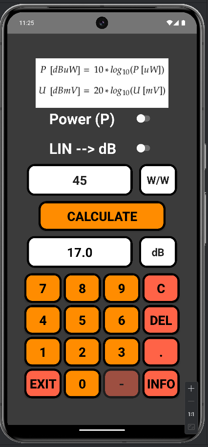

## dB-Calc:

Decibels are not a unit of measurement but a logarithmic representation of the ratio between two values of the same physical quantity.
The calculator allows you to convert units of watts (W) and volts (V) from a linear scale to a logarithmic scale, and vice versa.
The row of units range:
- [MW] to [pW/dBpW] 
- [dBMW] to [dBpW]
the same with volts



## Main Activity:


## Info Activity:

The app include informations about the most important values and equations to memorise.


## Instalation and Build process:

- Build -> Build App Bundle(s) -> Build APK(s)
- Open directory with application

    Files `apk-debug.apk` location is in directory:
    
   ```
    dB-Calc/app/build/outputs/app/debug
    ```

- Move it to cloud file server for example google drive
- Run on mobile device